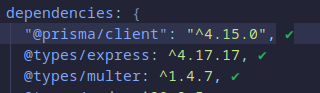

# nodePackageCheck for Neovim

- A plugin for Neovim that allows you to check updates and versions of your node packages from within Neovim.




### Example

- Show the latest version of any package from `registry.npmjs`.
- Check if packages are outdated inside `package.json`.

# Installation

- Work in progress : You still can manually install the plugin.
- git clone this repository:

#### Packer

- `use("azizgharbi/nodePackageCheck.nvim")`

#### Available commands

- `:NPCUpdateLineVersion`: Run the command on the line of the package whose version you wish to update.
- `:NPCUpdateMultipleLinesVersion`: Choose the lines in `packages.json` where you intend to update the package versions.

# Unit Test

- Using busted: [busted](https://lunarmodules.github.io/busted/).
```bash 
lua /path run busted
```

# Contributing

We welcome contributions from the community. If you have an idea for a feature or would like to report a bug, please create an issue on the project's GitHub repository.

If you would like to contribute code, please create a pull request with your changes. We ask that all contributions adhere to our code of conduct.

# License

This project is licensed under the MIT License.
